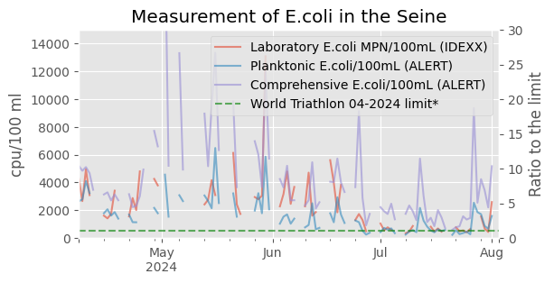
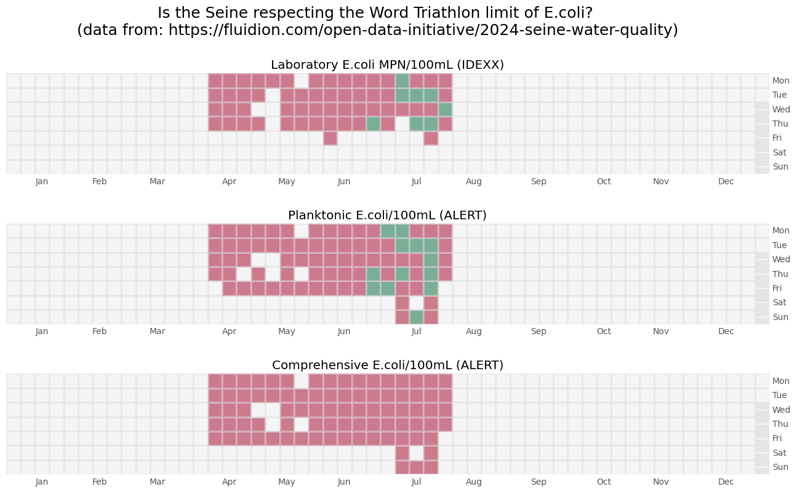

# Seine water quality is shitty...

Sources:
- [World Triathlon rules](https://www.triathlon.org/uploads/docs/World-Triathlon_Competition-Rules_2024_20240416.pdf): Escherichia coli E. Coli not more than 500 per 100 ml (cfu/100ml) for inland water from the rules published in april 2024.
- [Fluidion open data initiative](https://fluidion.com/open-data-initiative/2024-seine-water-quality) for the measurements. 

The disclaimer and  Copyright Notice is the following:

    "The water quality data shown on this page are collected and presented by Fluidion as a best efforts attempt to provide accurate- timely- and accessible information about the Seine River quality in the run-up and during the Olympic events. It combines samples collected by Fluidion personnel and by trained citizen scientists- under Fluidion oversight. Samples are collected in the Seine at the Alexandre III bridge in Paris- which is the 2024 Olympic venue.
    The data presented here are quality controlled by Fluidion scientists- which may introduce delays in the data availability. Any errors in the data are accidental- and whenever detected- they are corrected immediately.
    All data presented on this page belong to Fluidion and are protected by copyright. Any use of the data must provide a clear reference to this website and include the following text: "Data provided courtesy of the Fluidion Open Data Initiative".

The figure below compares the measured level to the World Triathlon limit.

The figure below show in green the satisfying the World Triathlon limit.

